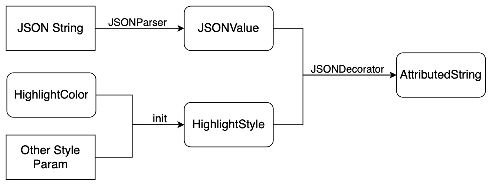

<p align="center">

</p>

<p align="center">
<a></a>
<a href="https://github.com/rakuyoMo/JSONPreview/releases"></a>
<a href="https://github.com/rakuyoMo/JSONPreview/blob/master/LICENSE"></a>
</p>

> [中文](https://github.com/rakuyoMo/JSONPreview/blob/master/README_CN.md)

`JSONPreview` inherits from `UIView` and implements functionality based on `UITextView`. You can use it to **format** your JSON data and **highlight** it for display.

Also `JSONPreview` provides **fold and expand** functionality, so you can collapse nodes that you are not interested in at the moment and re-display them at any time.

All of `JSONPreview`'s features are written using **native methods**, which means you get a great experience on the Apple platform.

## Screenshot

Here is a gif of about 25 seconds (**about 2.5M**) that shows the effect when using this library to preview JSON.


## Prerequisites

- **iOS 10 or later**.
- **Xcode 10.0 or later** required.
- **Swift 5.0 or later** required.

## Install

### CocoaPods

```ruby
pod 'JSONPreview'
```

### Swift Package Manager

- File > Swift Packages > Add Package Dependency
- Add https://github.com/rakuyoMo/JSONPreview.git
- Select "Up to Next Major" with "2.0.0"

Or add the following to your `Package.swift` file:

```swift
dependencies: [
  .package(url: "https://github.com/rakuyoMo/JSONPreview.git", from: "2.0.0")
]
```

## Features

> In `1.3.0` version, we removed the ability to slide diagonally. 
> Now if a JSON row is not displayed, it will be displayed folded instead of going beyond the screen. If you wish to use this feature, please use the [1.2.3](https://github.com/rakuyoMo/JSONPreview/releases/tag/1.2.3) version

- [x] Support for **formatted** display of JSON data.
- [x] Support for **highlighting** JSON data, with various color and font configuration options.
- [x] Provide **fold** and **expand** for `Array` and `Object`.
- [x] Based on `UITextView`, meaning you can copy any content in `JSONPreview`.

- `JSONPreview` provides limited, incomplete format checking functionality, so this feature is not provided as a main feature. For more details, please refer to: [Format check](#format-check)

## Usage

> After downloading the project, [`ViewController.swift`](JSONPreview/Other/ViewController.swift#L47) file contains part of the test code, just run the project Check the corresponding effect.

1. Create the `JSONPreview` object and add it to the interface.

```swift
let previewView = JSONPreview()

view.addSubview(previewView)
```

2. Call the `preview(_:style:)` method to preview the data in the default style:

```swift
let json = "{\"key\":\"value\"}"

previewView.preview(json)
```

3. If you want to customize the highlight style, you can set it through the `HighlightStyle` and `HighlightColor` types:

> Among them, [`ConvertibleToColor`](JSONPreview/Core/Entity/HighlightColor.swift#L117) is a protocol for providing colors. Through this protocol, you can directly use the `UIColor` object, or easily convert such objects as `0xffffff`, `#FF7F20` and `[0.72, 0.18, 0.13]` to `UIColor` objects.

```swift
let highlightColor = HighlightColor(
    keyWord: ConvertibleToColor,
    key: ConvertibleToColor,
    link: ConvertibleToColor,
    string: ConvertibleToColor,
    number: ConvertibleToColor,
    boolean: ConvertibleToColor,
    null: ConvertibleToColor,
    unknownText: ConvertibleToColor,
    unknownBackground: ConvertibleToColor,
    jsonBackground: ConvertibleToColor,
    lineBackground: ConvertibleToColor,
    lineText: ConvertibleToColor
)

let style = HighlightStyle(
    expandIcon: UIImage?,
    foldIcon: UIImage?,
    color: highlightColor,
    lineFont: UIFont?,
    jsonFont: UIFont?,
    lineHeight: CGFloat
)

previewView.preview(json, style: style)
```

## Format Check

### Rendering

For rendering, `JSONPreview` only performs **limited** formatting checks.

The conditions that are known to trigger `Error Rendering` include

- Value Unconventional JSON types. Supported types include `object`, `array`, `number`, `bool`, `string`, and `null`.
- Checks for the `number` format, such as scientific notation and decimals.
- Spell checking for `true`, `false` and `null`.
- For scientific notation, the next node of `{E/e}` must be `+`, `-` or a number.
- `array` elements are not separated by `,`.
- `object` elements are not separated by `,`.
- No `:` after the key of `object`.
- `object` has `:` after the key but is missing the value.
- The key of `object` is not a string.

In addition to the conditions explicitly mentioned above, other errors may also trigger an "error rendering". There may also be errors outside the scope of the formatting check that do not trigger "error rendering". However, they may **lead to missing json content**.

It is recommended that you do not rely too much on `JSONPreview` format checking, and use it to preview correctly formatted json whenever possible.

### Link

The *1.2.0* version adds rendering of links. While rendering, `JSONPreview` performs a limited **de-escaping** operation.

The de-escaping operations supported by different versions are as follows:

> If not otherwise specified, the following functions are cumulative.

- 1.2.0: Support replacing `"\\/"` with `"/"`.

## Data Flow Diagram



## TODO

- [ ] Support `Carthage`.
- [ ] Support for intel macOS.

## Thanks

Thanks to [Awhisper](https://github.com/Awhisper) for his valuable input during the development of `JSONPreview`.

## License

`JSONPreview` is available under the **MIT** license. For more information, see [LICENSE](LICENSE).
